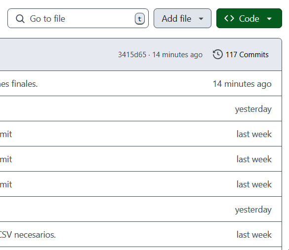
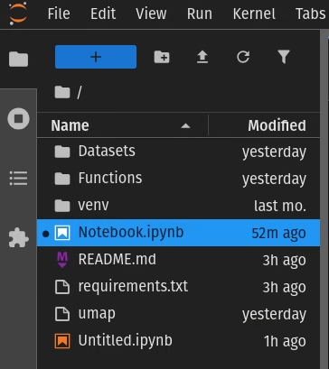

# Introducción.

Trabajo Práctico Especial para la materia _Teoría de la Información_.

En este trabajo, se realizó el análisis de cuatro _datasets_, correspondientes a las temperaturas promedio tomadas durante 16 años en tres ciudades: Quito, Melbourne y Oslo. Para ello, se aplicaron los conocimientos adquiridos en la materia.

A grandes rasgos, el trabajo realizado contempla:
- La limpieza de la información.
- El análisis de estadísticos básicos.
- La discretización de las fuentes.
- El cálculo de matrices de transición y vectores estacionarios.
- La codificación y comprensión de las fuentes discretizadas.
- El análisis del Teorema de Shannon.
- El uso de medidas entrópicas, como el ruido y la información mutua.

# Guía de instalación.

## Descarga de los archivos necesarios.

Se deben descargar los archivos necesarios, los cuales están contenidos en el repositorio. Se recomiendan los siguientes métodos.

### Utilizando Git.

En este método se utiliza la herramienta Git para clonar el repositorio en el destino deseado.
> [!IMPORTANT]
> No se incluye la [instalación de la herramienta Git](https://git-scm.com/book/en/v2/Getting-Started-Installing-Git) en esta guía, ya que escapa al alcance del trabajo.

Para clonar el repositorio, se debe abrir una terminal, dirigirse a la carpeta en la cual se desea descargar el repositorio y ejecutar el siguiente comando:

```
git clone https://github.com/iroumec/TPE-TDI
```

### Realizando una descarga directa desde el repositorio de GitHub.

Para esto se debe dirigir al [repositorio](https://github.com/iroumec/TPE-TDI) y seguir el siguiente tutorial.



## Creación del ambiente virtual.
>
> [!IMPORTANT]
> No se incluye la [instalación del lenguaje Python](https://www.youtube.com/watch?v=4EGfl6sWQ18) en esta guía, ya que escapa al alcance del trabajo.

Para asegurar que las dependencias se instalen correctamente y evitar conflictos entre versiones, se recomienda crear un entorno virtual. Desde la terminal, se debe navegar a la carpeta del proyecto y ejecutar:

```
python -m venv env
```

Activación del entorno virtual:

- En Linux o Mac:

```
source env/bin/activate
```

- En Windows:

```
.\env\Scripts\activate
```

## Instalación de dependencias.

Con el entorno virtual activo, se deben instalar las dependencias del archivo `requirements.txt` para poder ejecutar la notebook del análisis:

```
pip install -r requirements.txt
```

Luego, se debe realizar la instalacion de jupyter.

```
pip install jupyter
```

## Lectura de la notebook,

Una vez se ha instalado todo lo necesario, solo resta la lectura del archivo `notebook.ipynb`. Para esto, se recomiendan los siguientes métodos.

### Utilizando JupyterLab.
>
> [!IMPORTANT]
> No se incluye la [instalación de la herramienta JupyerLab](https://jupyterlab.readthedocs.io/en/stable/getting_started/installation.html) en esta guía, ya que escapa al alcance del trabajo.

Para utilizar JupyerLab, se debe ejecutar el siguiente comando:

```
jupyter lab
```

> [!WARNING]
> Esto se debe realizar con el ambiente activo para que se detecte correctamente el kernel.

Una vez allí, se debe dirigir al siguiente apartado:



### Utilizando el IDE de Visual Studio Code.
>
> [!IMPORTANT]
> No se incluye la [instalación del IDE Visual Studio Code](https://code.visualstudio.com/docs/). Se recomienda realizar la creacion del ambiente desde la consola del IDE.

Para utilizar este IDE, es necesaria instalar las extensiones que se mostrarán a continuación. Previamente, se debe presionar en el ícono de cuadrado en la barra lateral izquierda . Una vez allí, las extensiones a instalar son las de Python y Juýter, ambas publicadas por Microsoft:


Una vez que se han instalado las extensiones necesarias, en el apartado de _"file"_ en la parte superior izquierda, se debe seleccionar la opcion de _"Open Folder"_ y navegar hasta el apartado del proyecto. Es importante que el proyecto y el ambiente se encuentren en la misma carpeta para que este último sea detectado.
Es posible que el IDE no detecte automaticamente el kernel, si es el caso, realizar `Ctrl + Shift + P` para mostrar los comandos existentes y seleccionar "Python: Clear Cache and Reload Window".

Finalmente, al tener la carpeta seleccionada, se debe seleccionar el archivo `Notebook.ipynb` y presionar el boton 
